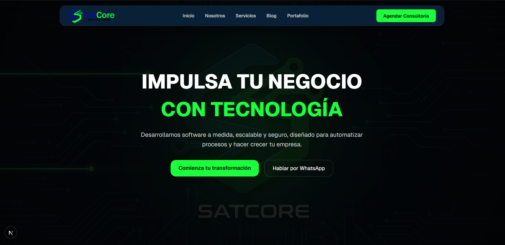
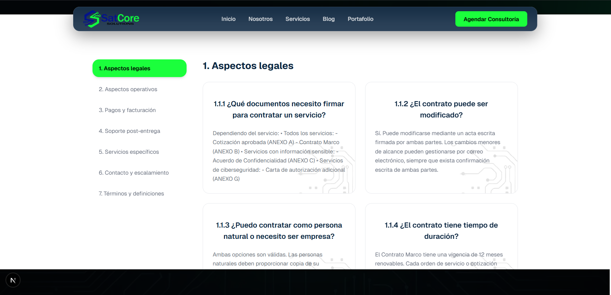
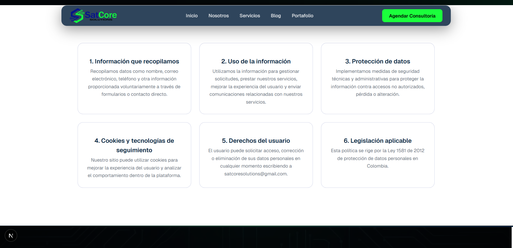

<p align="center">
  
</p>

<h1 align="center">🚀 SatCore Solutions</h1>

<p align="center">
  Plataforma web corporativa enfocada en desarrollo, ciberseguridad, automatización e IA.
</p>

<p align="center">
  
  
  
  
</p>

---

## 🧠 Sobre el Proyecto

**SatCore Solutions** es una plataforma web moderna diseñada para posicionar una marca tecnológica premium, enfocada en:

- Desarrollo de software a medida
- Ciberseguridad
- Automatización de procesos
- Integración de inteligencia artificial

---

## 🎯 Objetivos

- 🔥 Generar leads de alto valor
- ⚡ Ofrecer experiencia rápida y fluida
- 🧱 Construir una arquitectura escalable
- 🤖 Preparar integración con IA y automatización

---

## 🖼️ Screenshots

### 🏠 Home



### 📄 FAQ (Sistema dinámico)



### 🔐 Privacy & Terms (Legal UI)



> ⚠️ Nota: Agrega tus screenshots en `/public/screenshots/`

---

## ⚙️ Stack Tecnológico

| Tecnología      | Uso                 |
| --------------- | ------------------- |
| Next.js 16      | Framework principal |
| React 19        | UI                  |
| TypeScript      | Tipado              |
| Tailwind CSS v4 | Estilos             |
| Framer Motion   | Animaciones         |
| Lucide Icons    | Iconografía         |
| Resend          | Email               |

---

## 🧱 Arquitectura

```
/app
/components
  /ui
  /sections
  /shared
/data
/public
```

✔ Component-based  
✔ Data-driven  
✔ Escalable

---

## 🚀 Instalación

```bash
git clone <repo>
cd site_corporative
npm install
npm run dev
```

Abrir en:

```
http://localhost:3000
```

---

## 📈 Métricas de Calidad

| KPI              | Objetivo          |
| ---------------- | ----------------- |
| 🚀 Performance   | > 90 Lighthouse   |
| ⏱ LCP            | < 2.5s            |
| 📱 Responsive    | 100% Mobile-first |
| 🔒 Seguridad     | Headers + HTTPS   |
| ♿ Accesibilidad | WCAG 2.1          |

---

## 🎨 Sistema de Diseño

### Colores

- Azul: `#132A8E`
- Verde: `#1BFF3C`
- Negro: `#0A0A0A`
- Gris: `#F6F9FC`

### Regla

- 70% neutros
- 20% azul
- 10% verde (CTA)

---

## 🧠 Características Clave

- 🔥 UI moderna basada en componentes
- ⚡ Carga rápida optimizada
- 📊 Contenido dinámico (FAQ, Terms, Privacy)
- 🧩 Arquitectura modular
- 📱 Totalmente responsive
- 🔐 Enfoque en seguridad

---

## 🗺️ Roadmap

### ✅ Fase 1 (Completado)

- Landing page
- Sistema de secciones modular
- FAQ dinámico con data
- Pages legales (Terms / Privacy)

### 🚧 Fase 2 (En progreso)

- Integración de backend (API)
- Formulario con Resend
- Analytics y tracking

### 🔮 Fase 3 (Futuro)

- Dashboard cliente
- Integración con IA
- Automatización de procesos
- CMS interno

---

## 🌐 Deploy

Recomendado:

👉 Vercel

```bash
npm run build
```

---

## 📞 Contacto

- 📧 satcoresolutions@gmail.com
- 📱 +57 302 201 6072

---

## 📄 Licencia

© SatCore Solutions — Todos los derechos reservados.

---

## ⭐ Contribución

Actualmente este proyecto es privado y gestionado por SatCore Solutions.

---

<p align="center">
  Hecho con 💚 por SatCore Solutions
</p>
